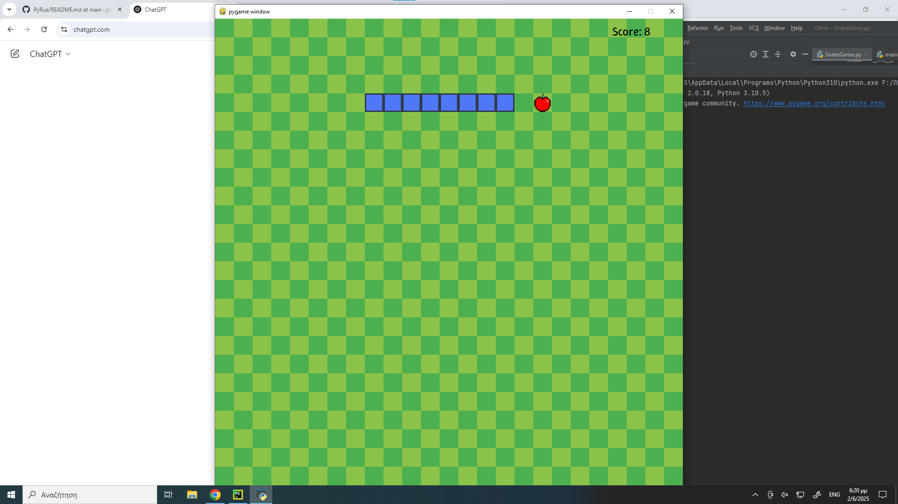

# 🐍 Snake Game with Pygame

A fun and retro-style Snake game built using **Python** and **Pygame**. Eat the apple, grow the snake, and try not to crash!

 <!-- Optional: Add a screenshot of gamepla -->

---

## 🚀 Features

- Classic snake gameplay
- Background music and sound effects
- Custom fonts and textures
- Win and game over screens
- Keyboard controls
- Fully playable in a 1000x1000 grid

---

## 🧰 Requirements

- Python 3.8 or higher
- Pygame library

---

## 🔧 Installation

1. **Clone the repository:**

```bash
git clone https://github.com/your-username/snake-game-pygame.git
cd snake-game-pygame
```

2. **Install dependencies:**

```bash
pip install pygame
```

3. **Make sure the `resources/` folder contains:**

```
resources/
├── apple-removebg-preview.png
├── background.jpg
├── bg_music_1.mp3
├── crash.mp3
├── ding.mp3
├── snake.jpg
├── WinkySans.ttf
```

4. **Run the game:**

```bash
python snake_game.py
```

---

## 🎮 Controls

| Key         | Action         |
|-------------|----------------|
| Arrow Keys  | Move the snake |
| Enter       | Resume/Restart |
| Escape      | Quit the game  |

---

## 🏁 Win Condition

- Reach a length of **169** to win the game.

---

## ⚠️ Game Over

- Collision with walls or yourself ends the game.

---

## 📦 Folder Structure

```
.
├── snake_game.py
├── README.md
└── resources/
    ├── apple-removebg-preview.png
    ├── background.jpg
    ├── bg_music_1.mp3
    ├── crash.mp3
    ├── ding.mp3
    ├── snake.jpg
    └── WinkySans.ttf
```

---

## 📜 License

This project is open-source and free to use under the [MIT License](LICENSE).

---

## 👨‍💻 Author

- [Oliver](https://github.com/jollyolliel/)
